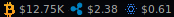

# awesome-coins

## Overview

`awesome-coins` allows you to display the value of any cryptocurrency in a
wibar. It's powered by [coinmarketcap's API](https://coinmarketcap.com/api/).

You could make it look like this:



## Installation & Usage

Clone this into your `awesome` root directory, most likely like this:

`git clone git@github.com:whatever ~/.config/awesome`

Edit your `rc.lua` or `theme.lua` to look something like this:

```lua
local coins = require("awesome-coins")

-- {{ Coin widgets
-- Ripple
local rippleicon = wibox.widget.imagebox('/path/to/icon.png')
local ripple = coins.coin({
    crypto = "ripple"
})
-- Bitcoin
local bitcoinicon = wibox.widget.imagebox('/path/to/icon.png')
local bitcoin = coins.coin({
    crypto = "bitcoin"
})
-- Cardano
local cardanoicon = wibox.widget.imagebox('/path/to/icon.png')
local cardano = coins.coin({
    crypto = "cardano"
})
-- }}

-- {{ Wibar
function theme.at_screen_connect(s)
    -- Create the wibox
    s.mywibox = awful.wibar({ ... })

    -- Add widgets to the wibox
    s.mywibox:setup {
        layout = wibox.layout.align.horizontal,
        { -- Left widgets
            layout = wibox.layout.fixed.horizontal,
            theme
        },
        ...
    }
end
-- }}
```